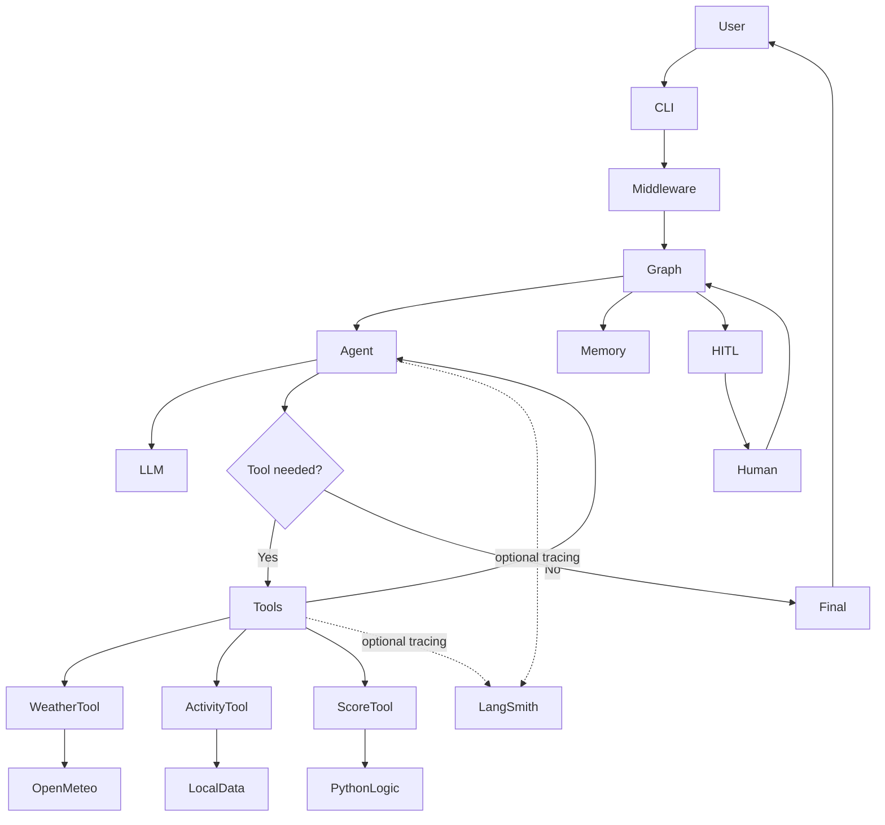

# Travel + Weather AI Agent

A beginner-friendly learning project that shows how modern LangChain applications grow from raw model calls into a tool-calling agent with LangGraph state, memory, optional observability, and a small human-in-the-loop example.

## Project Overview

The final app answers travel and weather questions such as:

- "What is the weather in Boston?"
- "What should I do in Boston tomorrow?"
- "Should I visit Boston or Miami this weekend?"
- "Compare Boston, Chicago, and Miami and recommend one."

The project uses free Open-Meteo APIs for weather and a small local destination dataset for activity ideas.

## Why This Project Exists

This repository is educational. It demonstrates each concept in a visible layer instead of hiding everything in one framework call.

## Final Architecture



## Concepts Demonstrated

- Raw LLM HTTP calls
- LangChain chat model abstraction
- Pydantic schemas
- Open-Meteo geocoding and forecasts
- LangChain tools
- deterministic trip scoring
- structured output
- tool-calling agent loop
- middleware
- LangGraph state and conditional routing
- conversation memory
- human-in-the-loop interrupt/resume
- optional LangSmith tracing

## Project Structure

```text
src/travel_weather_agent/
|-- main.py
|-- agents/
|-- cli helpers in main.py
|-- config/
|-- data/
|-- graph/
|-- llm/
|-- middleware/
|-- schemas/
|-- services/
`-- tools/
tests/
```

## Setup

```bash
uv sync
```

Or with pip:

```bash
python -m venv .venv
python -m pip install -e ".[dev]"
```

## Environment Variables

Copy `.env.example` to `.env`.

```env
LLM_PROVIDER=groq
OPENAI_API_KEY=
OPENAI_MODEL=gpt-4o-mini
GROQ_API_KEY=
GROQ_MODEL=llama-3.3-70b-versatile
OLLAMA_MODEL=llama3.1
OLLAMA_BASE_URL=http://localhost:11434
TEMPERATURE_UNIT=fahrenheit
LANGSMITH_TRACING=false
LANGSMITH_API_KEY=
LANGSMITH_PROJECT=travel-weather-agent
```

## Architectural Evolution

```text
Phase 2
Application -> raw HTTP -> provider

Phase 3
Application -> LangChain model -> provider

Phase 4
Application -> tools/services -> external data

Phase 5
User -> agent -> tool decisions -> LangGraph

Phase 6
Agent -> observability + memory + HITL + final app
```

## Raw LLM API

`llm/direct.py` calls OpenAI, Groq, or Ollama directly with `httpx`.

```bash
uv run python -m travel_weather_agent.main --raw-llm-demo --prompt "Give me one travel tip."
```

## LangChain Model Abstraction

`llm/model.py` exposes:

```python
llm = get_llm()
response = llm.invoke(messages)
```

The caller does not need to know whether the backend is OpenAI, Groq, or Ollama.

```bash
uv run python -m travel_weather_agent.main --langchain-demo --prompt "Give me one travel tip."
```

## Pydantic Schemas

Schemas define and validate application data:

- `LocationInfo`
- `DailyWeather`
- `WeatherForecast`
- `DestinationActivities`
- `TripScore`
- `TravelRecommendation`

## Open-Meteo Integration

`services/open_meteo.py` handles external HTTP calls and normalizes API payloads. It does not depend on LangChain.

```bash
uv run python -m travel_weather_agent.main --weather-demo Boston
```

## LangChain Tools

Tools wrap normal Python functions so the LLM can request them:

- `geocode_location`
- `get_weather`
- `get_destination_activities`
- `calculate_trip_score`

The API client talks to external services. The tool exposes capability to an agent. The schema validates data.

## Deterministic Scoring

Design principle:

```text
LLM decides WHAT needs to happen.
Python decides HOW deterministic calculations are performed.
```

Example: the LLM asks for a trip score; `calculate_trip_score` returns the score using fixed Python math.

## Structured Output

The recommendation demo uses:

```python
llm.with_structured_output(TravelRecommendation)
```

```bash
uv run python -m travel_weather_agent.main --recommendation-demo Boston
```

## Tool-Calling Agent

Phase 4 used a deterministic workflow where application code chose functions. Phase 5 uses an agent where the LLM chooses tools.

For "What is the weather in Boston?", the agent should call `get_weather`.

For "Compare Boston and Miami and recommend one", the agent may call weather and scoring tools for both cities before answering.

```bash
uv run python -m travel_weather_agent.main --agent-demo --prompt "Should I visit Boston or Miami this weekend?"
```

## Middleware

Middleware provides cross-cutting behavior around execution:

- request validation
- logging
- timing
- retry
- error normalization

Middleware should not contain core travel logic.

## LangGraph

LangGraph controls the agent/tool loop:

```text
Agent -> tool call? -> Tools -> Agent -> no tool call -> END
```

Loops have a recursion limit so a model cannot request tools forever.

Show the graph:

```bash
uv run python -m travel_weather_agent.main --show-graph
```

## State

State is information moving through one graph execution, primarily messages and execution flags.

## Memory

Conversation memory is message history persisted for the same `thread_id` using an in-memory LangGraph checkpointer.

Long-term memory would mean extracted durable user facts across sessions. This project does not implement long-term memory.

```bash
uv run python -m travel_weather_agent.main --agent-demo --thread-id demo-user
```

Try:

```text
I prefer warmer weather.
Should I visit Boston or Miami?
```

## Human-In-The-Loop

Phase 6 adds a small separate LangGraph interrupt/resume demo. The graph pauses with `interrupt()`, stores state through a checkpointer, and resumes with `Command(resume=...)`.

```bash
uv run python -m travel_weather_agent.main --hitl-demo
```

Checkpointing is required because resume needs the graph state from the paused thread.

## LangSmith

LangSmith tracing is optional. The app works without it.

```env
LANGSMITH_TRACING=true
LANGSMITH_API_KEY=your_key
LANGSMITH_PROJECT=travel-weather-agent
```

When enabled, LangChain/LangGraph can show LLM calls, tool calls, latency, token usage where available, errors, and execution sequence. Trace metadata includes non-secret values such as `thread_id`, application name, provider, and model.

## Testing

Normal tests mock external APIs and LLMs.

```bash
uv run pytest -v
```

## Running Each Demo

```bash
uv run python -m travel_weather_agent.main --raw-llm-demo --prompt "Give me one travel tip."
uv run python -m travel_weather_agent.main --langchain-demo --prompt "Give me one travel tip."
uv run python -m travel_weather_agent.main --weather-demo Boston
uv run python -m travel_weather_agent.main --activities-demo Boston
uv run python -m travel_weather_agent.main --recommendation-demo Boston
uv run python -m travel_weather_agent.main --agent-demo --prompt "Should I visit Boston or Miami this weekend?" --show-tool-calls
uv run python -m travel_weather_agent.main --agent-demo --debug --prompt "What should I do in Boston tomorrow?"
uv run python -m travel_weather_agent.main --hitl-demo
uv run python -m travel_weather_agent.main --show-graph
```

## Example Conversations

```text
You: What is the weather in Boston?
Agent: Calls get_weather, then summarizes the forecast.

You: What should I do in Boston tomorrow?
Agent: Calls get_weather and get_destination_activities, then recommends indoor or outdoor plans.

You: Should I visit Boston or Miami this weekend?
Agent: Gathers weather, may score each city, then recommends one.
```

## Future Improvements

- durable SQLite/Postgres checkpointing
- LangSmith dashboards and saved example datasets
- Streamlit UI
- richer destination data
- long-term preference memory
- deployment packaging

