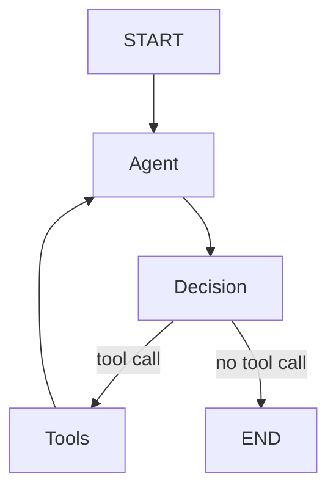
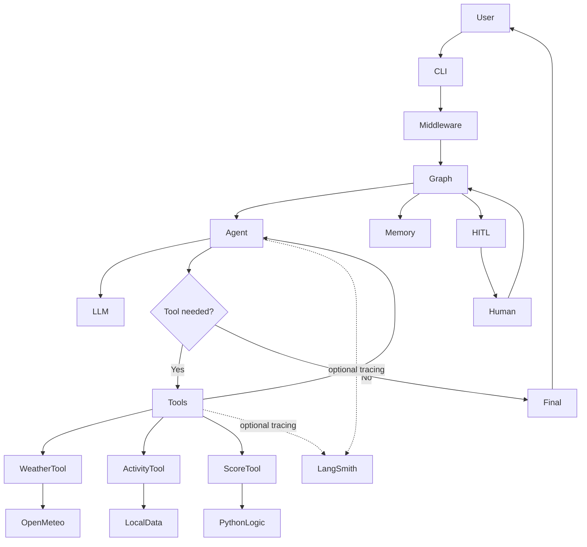

Proceed with **Phase 6 — Observability, Human-in-the-Loop, Final Validation, and Project Polish**.

Current status:

```text
Phase 1 ✅ Project setup
Phase 2 ✅ Raw LLM API
Phase 3 ✅ LangChain model abstraction
Phase 4 ✅ Weather APIs + schemas + tools + structured output
Phase 5 ✅ Agent + middleware + LangGraph + memory
Phase 6 ← NOW
```

All existing tests currently pass.

The goal of this final implementation phase is to complete the learning project by adding:

```text
1. LangSmith observability
2. Human-in-the-loop example
3. Better CLI/debug experience
4. Final integration tests
5. Architecture documentation
6. Optional lightweight UI
7. Final end-to-end validation
```

Do not introduce unnecessary new frameworks or convert this into a large production system.

Keep all existing functionality and tests working.

---

# 1. Add optional LangSmith observability

Integrate LangSmith tracing in a way that is fully optional.

The application must continue working when LangSmith is not configured.

Support environment variables such as:

```env
LANGSMITH_TRACING=true
LANGSMITH_API_KEY=
LANGSMITH_PROJECT=travel-weather-agent
```

Use the current official LangChain/LangSmith integration mechanism for the installed package versions.

Do not build custom HTTP calls to LangSmith if native tracing already exists.

The goal is to make these observable:

```text
User request
   ↓
Agent run
   ↓
LLM call
   ↓
Tool call
   ↓
Tool result
   ↓
LLM call
   ↓
Final response
```

Where available, LangSmith should expose:

```text
latency
token usage
tool calls
model calls
errors
execution sequence
```

Never log API keys.

Add a configuration helper such as:

```python
def is_langsmith_enabled() -> bool:
    ...
```

if useful.

Document that LangSmith is optional and not required for the application to work.

---

# 2. Add useful trace metadata

Where supported by current APIs, attach simple metadata such as:

```text
thread_id
application = travel-weather-agent
environment = local
provider
model
```

Do not attach sensitive user data unnecessarily.

Avoid overengineering custom callback handlers if built-in LangSmith tracing already covers the required observability.

---

# 3. Human-in-the-loop example

Add one small but genuinely working human-in-the-loop workflow using LangGraph.

Do not rewrite the entire travel agent around HITL.

Create a separate example or optional flow that demonstrates:

```text
Agent / graph
    ↓
multiple reasonable destination options
    ↓
INTERRUPT
    ↓
user chooses destination
    ↓
graph resumes
    ↓
final recommendation
```

For example:

```text
User:
"Help me choose between Boston, New York, and Washington DC."

System:
"I found three options. Which should I explore further?"

[graph pauses]

User:
"Boston"

[graph resumes]

System:
retrieves Boston details and returns recommendation
```

Use the current recommended LangGraph interrupt/resume API.

Inspect the installed LangGraph version and use the supported mechanism, such as `interrupt()` / `Command(resume=...)` if appropriate.

Do not simulate HITL using a normal `input()` inside a graph node if LangGraph supports proper pause/resume semantics.

---

# 4. Keep HITL state understandable

Create only the minimal state required.

For example:

```python
class HumanReviewState(TypedDict):
    messages: ...
    candidate_cities: list[str]
    selected_city: str | None
```

The example should make clear:

```text
normal graph execution
        ↓
interrupt
        ↓
state checkpoint
        ↓
human input
        ↓
resume same graph/thread
```

Document why checkpointing is required for resume behavior.

---

# 5. HITL CLI demo

Add a command such as:

```powershell
uv run python -m travel_weather_agent.main --hitl-demo
```

Example experience:

```text
Travel + Weather Agent — Human-in-the-loop Demo

Candidate destinations:
1. Boston
2. New York
3. Washington DC

Choose a destination: 1

Resuming graph...

Recommendation for Boston:
...
```

Internally, use the actual LangGraph pause/resume behavior.

The CLI may collect input, but the graph itself should pause using LangGraph mechanisms rather than simply calling `input()` from inside a node.

---

# 6. Improve agent debug output

Keep the existing `--show-tool-calls`.

Add or improve optional debug output so a learner can observe:

```text
[agent] received request
[tool] get_weather(city="Boston")
[tool] calculate_trip_score(...)
[agent] final response
```

Do NOT expose private chain-of-thought.

Only expose:

```text
tool name
tool arguments
tool result summary
graph transitions where useful
timing
```

If practical, add:

```text
--debug
```

which enables this higher-level execution trace.

---

# 7. Add optional graph visualization

If supported cleanly by the installed LangGraph version, provide a way to print or generate a Mermaid graph representation.

For example:

```python
graph.get_graph().draw_mermaid()
```

Expose a command such as:

```powershell
uv run python -m travel_weather_agent.main --show-graph
```

It may print Mermaid text.

Do not require external rendering services.

Expected conceptual output:



This is mainly educational.

---

# 8. Final CLI experience

Keep all previous commands working:

```text
--raw-llm-demo
--langchain-demo
--weather-demo
--activities-demo
--recommendation-demo
--agent-demo
```

Add:

```text
--hitl-demo
--show-graph
```

Keep CLI parsing readable.

Do not allow `main.py` to become an enormous file.

If needed, move demo runners into:

```text
src/travel_weather_agent/cli/
```

or equivalent.

---

# 9. Optional lightweight UI

Only implement this if it is simple and does not destabilize the project.

A minimal Streamlit UI is acceptable.

If implemented, place it separately, for example:

```text
app/streamlit_app.py
```

The UI should only provide:

```text
chat input
agent response
optional tool-call display
thread/session id
```

Do not build complex dashboards.

Do not make Streamlit required for the core project.

If adding Streamlit would significantly increase complexity, skip it and document it as a possible extension.

CLI remains the primary interface.

---

# 10. Integration tests

Add a small set of final integration-style tests that exercise multiple internal components together while still mocking expensive/external dependencies.

Examples:

```text
agent + mocked weather tool
agent + scoring tool
graph + memory across two turns
middleware + graph invocation
HITL interrupt + resume
```

Do not call Groq/OpenAI/Open-Meteo in normal tests.

Keep tests deterministic.

---

# 11. Optional live smoke tests

Create clearly separated manual smoke tests or commands for:

```text
Groq
Open-Meteo
full agent
memory
HITL
```

Do not run paid API tests automatically in pytest.

Document exact commands.

---

# 12. Final README rewrite/polish

Turn the README into a complete learning-oriented project guide.

Include these major sections:

```text
1. Project overview
2. Why this project exists
3. Final architecture
4. Concepts demonstrated
5. Project structure
6. Setup
7. Environment variables
8. Raw LLM API
9. LangChain model abstraction
10. Pydantic schemas
11. Open-Meteo integration
12. LangChain tools
13. Deterministic scoring
14. Structured output
15. Tool-calling agent
16. Middleware
17. LangGraph
18. State
19. Memory
20. Human-in-the-loop
21. LangSmith
22. Testing
23. Running each demo
24. Example conversations
25. Future improvements
```

Do not make the README unnecessarily verbose, but make it sufficient for someone reviewing the GitHub repository to understand the architecture.

---

# 13. Final architecture diagram

Include a clear Mermaid diagram similar to:



---

# 14. Explain the architectural evolution

Add a concise README section showing the progression:

```text
Phase 2
Application → raw HTTP → provider

Phase 3
Application → LangChain model → provider

Phase 4
Application → tools/services → external data

Phase 5
User → agent → tool decisions → LangGraph

Phase 6
Agent → observability + memory + HITL + final app
```

This is important because the repository is meant to demonstrate concepts progressively.

---

# 15. Explain agent vs workflow

Include a clear explanation:

```text
Deterministic workflow:
application decides which functions execute

Agent:
LLM decides which tools are required

LangGraph:
controls and persists the agent/tool execution loop
```

Include a short example using:

```text
"What is the weather in Boston?"
```

and:

```text
"Compare Boston and Miami and recommend one."
```

---

# 16. Explain state vs memory

Document clearly:

```text
State
= information moving through one graph execution

Conversation memory
= graph/message history stored for the same thread across turns

Long-term memory
= extracted persistent user facts across sessions
```

The project only needs state + conversation memory.

---

# 17. Explain middleware

Document middleware as cross-cutting behavior around execution:

```text
request validation
logging
timing
retry
error normalization
```

Explain that middleware should not contain core travel/business logic.

---

# 18. Explain deterministic tools

Highlight the project design principle:

```text
LLM decides WHAT needs to happen.

Python decides HOW deterministic calculations are performed.
```

For example:

```text
LLM:
"I need a trip score."

Tool:
returns 70.2/100 deterministically.
```

---

# 19. Testing

Run the complete suite:

```powershell
uv run pytest -v
```

All previous tests must remain passing.

Add new Phase 6 tests.

If the test count changes, report the final count.

Also run any configured lint/type checks.

Do not claim a test passed unless it was actually executed.

---

# 20. Manual end-to-end validation

After tests pass, manually verify:

### Raw LLM

```powershell
uv run python -m travel_weather_agent.main --raw-llm-demo --prompt "Give me one travel tip."
```

### LangChain model

```powershell
uv run python -m travel_weather_agent.main --langchain-demo --prompt "Give me one travel tip."
```

### Weather

```powershell
uv run python -m travel_weather_agent.main --weather-demo Boston
```

### Activities

```powershell
uv run python -m travel_weather_agent.main --activities-demo Boston
```

### Structured recommendation

```powershell
uv run python -m travel_weather_agent.main --recommendation-demo Boston
```

### Agent

```powershell
uv run python -m travel_weather_agent.main --agent-demo --prompt "Should I visit Boston or Miami this weekend?" --show-tool-calls
```

### Memory

Run an interactive session such as:

```text
I prefer warmer weather.
Should I visit Boston or Miami?
```

Confirm the second turn can use prior context.

### Human-in-the-loop

```powershell
uv run python -m travel_weather_agent.main --hitl-demo
```

### Graph visualization

```powershell
uv run python -m travel_weather_agent.main --show-graph
```

---

# 21. Keep the final architecture simple

Do NOT introduce:

```text
multi-agent systems
Redis
PostgreSQL
Celery
Kafka
Docker/Kubernetes
authentication systems
production deployment infrastructure
complex vector databases
```

Those are outside the scope of this learning project.

---

# 22. Final project cleanup

Before stopping:

```text
remove unused imports
remove dead code
remove temporary debugging code
check .gitignore
ensure .env is ignored
ensure .env.example contains no secrets
ensure README commands work
ensure type hints are reasonable
ensure files are organized
```

Do not delete Phase 2 raw implementation because it is useful for teaching the progression.

---

# 23. Final summary

At the end, provide:

```text
Final test count
Files created
Files modified
Dependencies added
LangSmith implementation
HITL implementation
Graph visualization
Final CLI commands
Known limitations
Optional future improvements
```

Then stop.

Do not add further phases.

After this phase the implementation portion of the project is complete, and the next activity will be a detailed walkthrough of the code and architecture.
